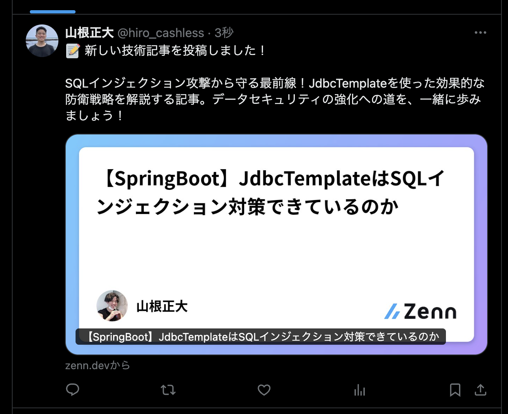
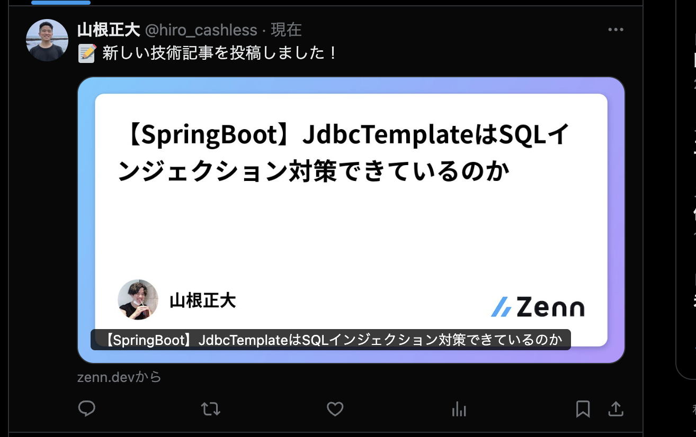

# zenn-x-post

Zennの記事を自動でXに投稿！  
AIによるリード文生成もワンストップで完結するGitHub Actions用カスタムアクションです。

---

> **ご注意**
>
> 本リポジトリを利用して発生するOpenAIやX（旧Twitter）APIの利用料金・課金については、
> 各サービスの公式ドキュメント・利用規約をご確認ください。
> 当リポジトリおよび作者は一切の責任を負いません。

---

## 投稿例（スクリーンショット）

- **OpenAIあり（AIリード文付き）**

<div align="center">
  
</div>

- **OpenAIなし（シンプル投稿）**

<div align="center">
  
</div>

---

## 概要

**zenn-x-post** は、Zennの記事管理リポジトリで新しい記事や公開設定の変更があった際に、  
AI（OpenAI API）で魅力的なリード文を自動生成し、Xへ自動投稿します。

OpenAI APIキーを指定しない場合は、AIリード文生成をスキップし「📝 新しい技術記事を投稿しました！+URL」のみをXに投稿します。お金かけたくない場合はこちらを利用ください！

---

## 主な特徴

- **新規・公開変更記事の自動検出**  
  `published: true` になった記事だけを自動で検出
- **AIによるリード文自動生成（オプション）**  
  OpenAI API（GPT-4）でX向けのリード文を自動作成（APIキー未指定時はスキップ）
- **Xへの自動投稿**  
  生成したリード文＋記事URLをXに自動投稿

---

## クイックスタート（Get Started）

### 1. 必要な準備

- **ZennのユーザーID**（例: `kannna5296`）を確認
- **APIキーの登録**  
  GitHubリポジトリの「Settings > Secrets and variables > Actions」で以下を登録
  - `X_API_KEY`
  - `X_API_SECRET`
  - `X_ACCESS_TOKEN`
  - `X_ACCESS_SECRET`
  - `OPENAI_API_KEY`（AIリード文生成を使いたい場合のみ）

---

### 2. ワークフロー例

Zenn記事管理リポジトリの `.github/workflows/post-to-x-with-ai.yml` 例：

```yaml
name: Post to X with AI Lead Generation

on:
  push:
    branches:
      - main
    paths:
      - 'articles/**/*.md'
      - 'books/**/*.md'

jobs:
  post-to-x:
    runs-on: ubuntu-latest
    steps:
      - name: Checkout code
        uses: actions/checkout@v4
        with:
          fetch-depth: 2

      - name: Get changed files
        id: diff
        run: |
          NEW_FILES=$(git diff --name-only --diff-filter=A HEAD~1 HEAD | grep -E '\.(md)$' | grep -E '^(articles|books)/' || echo "")
          echo "new_files=${NEW_FILES}" >> $GITHUB_OUTPUT
          MODIFIED_FILES=$(git diff --name-only --diff-filter=M HEAD~1 HEAD | grep -E '\.(md)$' | grep -E '^(articles|books)/' || echo "")
          echo "modified_files=${MODIFIED_FILES}" >> $GITHUB_OUTPUT

      - name: Post to X with AI
        uses: kannna5296/zenn-x-post@v0
        with:
          zenn_user_id: <あなたのZennユーザーID>
          new_files: ${{ steps.diff.outputs.new_files }}
          modified_files: ${{ steps.diff.outputs.modified_files }}
          x_api_key: ${{ secrets.X_API_KEY }}
          x_api_secret: ${{ secrets.X_API_SECRET }}
          x_access_token: ${{ secrets.X_ACCESS_TOKEN }}
          x_access_secret: ${{ secrets.X_ACCESS_SECRET }}
          openai_api_key: ${{ secrets.OPENAI_API_KEY }} # 省略可
```

- `openai_api_key` を省略するとAIリード文生成なしでシンプルなX投稿のみ行われます。
- `zenn_user_id` にはご自身のZennユーザーIDを指定してください。

---

## 仕組み・カスタマイズ

- **主要スクリプト**
  - `scripts/check-articles.py` … 新規/公開記事の検出・タイトル/URL抽出
  - `scripts/generate-ai-lead.py` … OpenAI APIでリード文生成（APIキー未指定時はスキップ、投稿文組み立ても担当）
  - `scripts/tweet.py` … X投稿
- **GitHub Actions用定義**  
  - `action.yml` … 入力パラメータや出力値の定義

---

## よくある質問

### Q. AIリード文生成は必須ですか？
A. いいえ、`openai_api_key` を指定しなければAIリード文生成はスキップされ、シンプルなX投稿のみ行われます。

### Q. Zenn以外のサービスにも対応できますか？
A. 現状はZenn専用ですが、スクリプトを拡張すれば他サービスにも応用可能です。

### Q. どんなリード文が生成されますか？
A. 技術的な価値を強調し、読者の興味を引く90文字以内のリード文が自動生成されます。

---

## ライセンス

MIT License

---

ご不明点・要望は [Issues](https://github.com/kannna5296/zenn-x-post/issues) までお気軽にどうぞ！ 